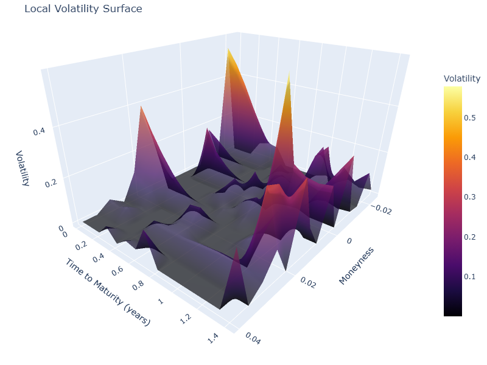
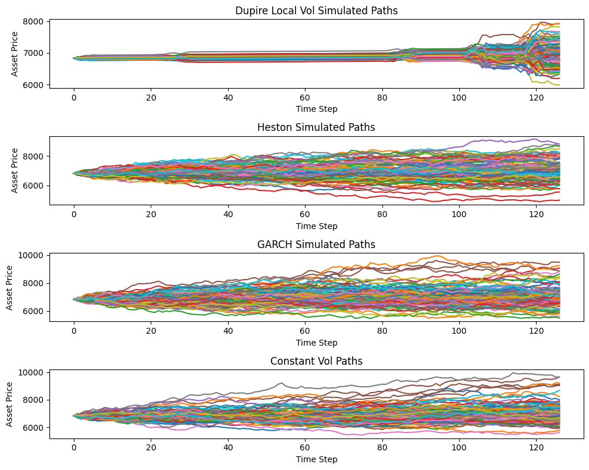
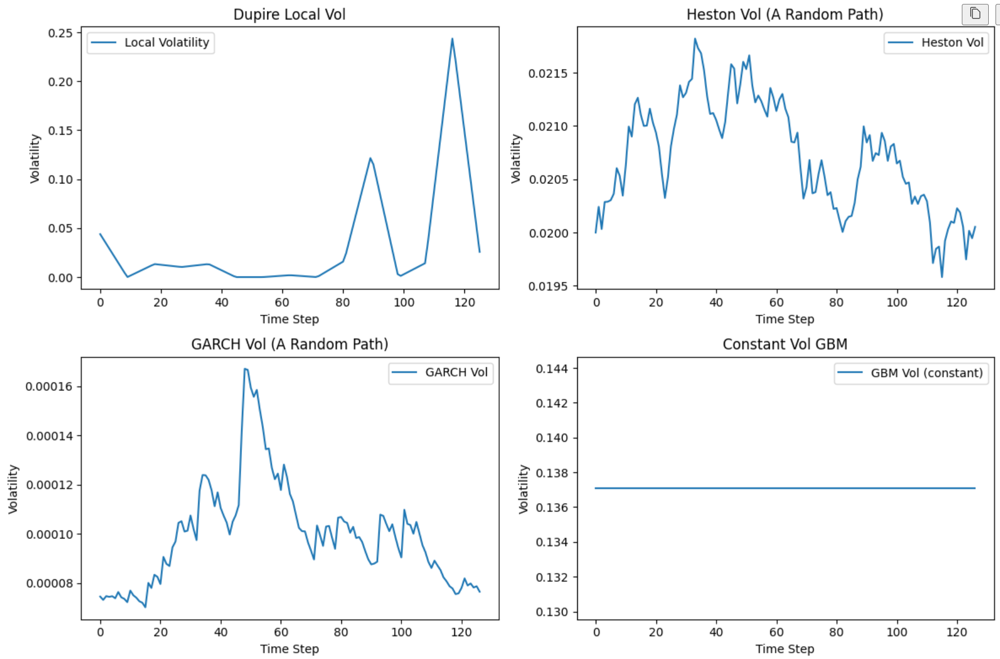
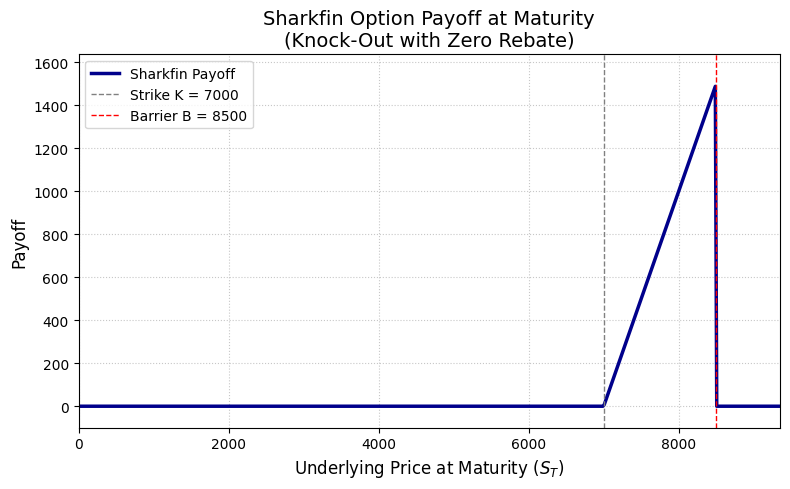
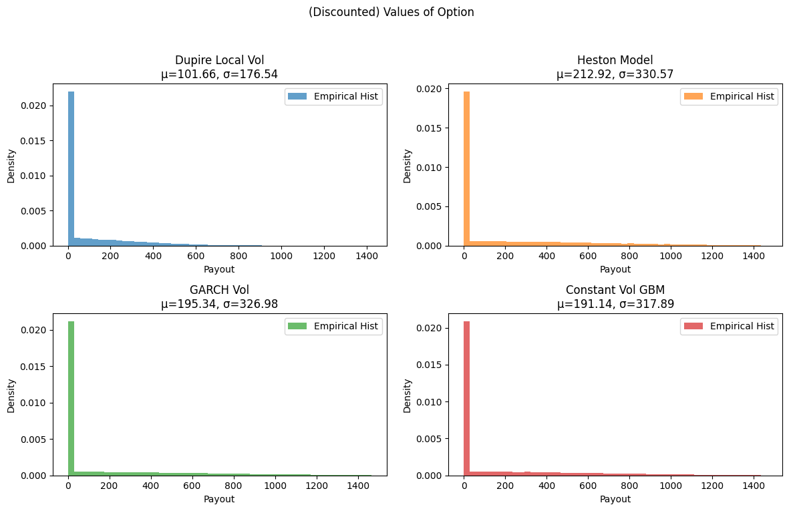
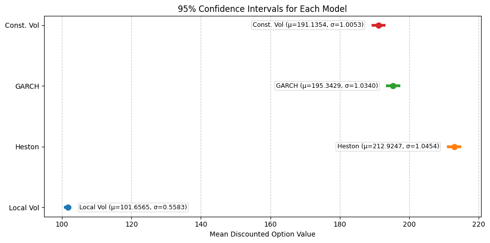
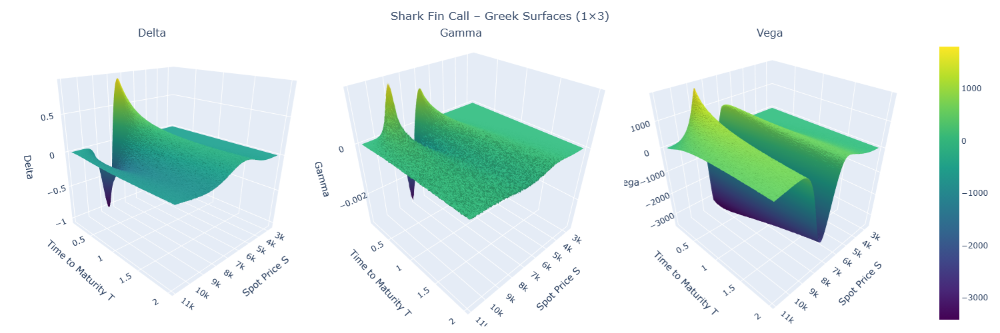

# VOLATILITY IS ALL YOU NEED

**Monte Carlo Option Pricing: Volatility Modeling Comparison**

A comprehensive Monte Carlo simulation framework for pricing exotic options (specifically Shark Fin barrier options) using multiple stochastic volatility models. This project compares four different volatility modeling approaches and evaluates their performance through extensive simulations and statistical analysis.

## 📋 Table of Contents

- [Overview](#overview)
- [Project Structure](#project-structure)
- [Features](#features)
- [Volatility Models](#volatility-models)
- [Key Components](#key-components)
- [Installation](#installation)
- [Usage](#usage)

## 🎯 Overview

This project implements and compares multiple volatility modeling approaches for Monte Carlo option pricing:

1. **Constant Volatility GBM** (Baseline) - Traditional Black-Scholes framework
2. **Dupire Local Volatility** - Market-implied local volatility surface
3. **Heston Stochastic Volatility** - Mean-reverting variance process
4. **GARCH(1,1)** - Time-varying conditional volatility

The framework is designed to price **Shark Fin options** (barrier call options with knock-out features) and compute option Greeks using Monte Carlo methods.

## 📁 Project Structure

```
MonteCarloOptionPricing/
│
├── main.ipynb                 # Main analysis notebook
├── Requirements.txt           # Python dependencies
│
├── Data Processing/
│   ├── Load_data_yfiance.py  # Market data retrieval and preprocessing
│   ├── Fit_interp_regres.py  # Interpolation and regression methods
│   └── Imp_vol.py            # Implied volatility calculation
│
├── Volatility Models/
│   ├── BaseLineGBM.py        # Constant volatility GBM
│   ├── dupire.py             # Dupire local volatility
│   ├── heston.py             # Heston stochastic volatility
│   └── garch.py              # GARCH(1,1) model
│
├── Option Pricing/
│   ├── BS_model.py           # Black-Scholes analytical formulas
│   ├── greeks.py             # Greeks computation
│   └── plot_result.py        # Valuation and payoff functions
│
├── Visualization/
│   ├── plot_result.py        # Path and distribution plots
│   ├── plot_loc_vol_surface.py  # Local volatility surface
│   ├── plot_2_interp.py     # Interpolation comparison
│   └── plot_data_hist.py    # Data distribution plots
│
├── DataSet/                  # Market data storage
│   └── *.csv, *.pkl         # Historical option data
│
└── demo_img/                 # Demonstration images
    ├── Greeks.png
    ├── local_vol_surface.png
    ├── MC_path.png
    ├── MC_vol_path.png
    ├── Shark_Fin.png
    ├── Simulated_Asset_Price.png
    ├── Test_Confidence_interval.png
    └── Valuation.png
```

## ✨ Features

- **Multi-Model Comparison**: Compare four different volatility modeling approaches
- **Market Data Integration**: Real-time option chain data retrieval
- **Volatility Surface Construction**: Build local volatility surface from market data
- **Monte Carlo Simulation**: High-performance path simulation (100,000+ paths)
- **Exotic Option Pricing**: Shark Fin barrier option valuation with American-style barrier monitoring
- **Greeks Calculation**: Delta, Gamma, and Vega computation via finite differences
- **Statistical Analysis**: Confidence intervals and distribution analysis
- **Comprehensive Visualization**: Path plots, volatility surfaces, payoff distributions, and Greeks

## 📊 Volatility Models

### 1. Constant Volatility GBM (Baseline)
Traditional geometric Brownian motion with constant volatility estimated from historical returns.

### 2. Dupire Local Volatility
Market-implied local volatility surface constructed from option prices using Dupire's formula. The surface is built using cubic spline interpolation across strikes and maturities.

### 3. Heston Stochastic Volatility
Two-factor model where both the asset price and variance follow stochastic processes:
- Mean-reverting variance process
- Correlation between asset returns and variance
- Calibrated to market option prices

### 4. GARCH(1,1)
Time-varying conditional volatility model that captures volatility clustering:
- Parameters estimated from historical returns
- Captures volatility persistence and mean reversion

## 🔧 Key Components

<h3 style="font-size: 1.5em;">Data Loading (`Load_data_yfiance.py`)</h3>

Retrieves option chain data from Yahoo Finance, computes implied volatilities using Black-Scholes, and calculates forward prices and dividend yields via put-call parity. The system automatically fetches real-time option data and prepares it for model calibration.

<h3 style="font-size: 1.5em;">Model Calibration</h3>

Calibrate volatility models to market data. Each model uses different calibration approaches:

- **Heston**: Calibrates 5 parameters (v₀, κ, θ, ρ, σ) to market prices using optimization techniques
- **GARCH**: Estimates ω, α, β from historical return data using maximum likelihood estimation
- **Dupire**: Constructs local volatility surface using spline interpolation across strikes and maturities

**Local Volatility Surface:**


<h3 style="font-size: 1.5em;">Monte Carlo Simulation</h3>

Generate price and volatility paths using advanced numerical methods. The framework implements:

- Euler-Maruyama discretization for path generation
- Correlated Brownian motions for Heston model
- Path-dependent barrier monitoring for exotic options
- 100,000+ simulation paths for statistical accuracy
**Monte Carlo Paths:**


**Volatility Paths:**


**Simulated Asset Price Distributions:**


<h3 style="font-size: 1.5em;">Valuation Functions</h3>

Price exotic options with path-dependent features. The framework supports:

- **Shark Fin Option**: Barrier call with knock-out feature
- **American Barrier Monitoring**: Checks barrier at each time step along the path
- **Discounting**: Risk-neutral discounting to present value

**Shark Fin Option Payoff Structure:**


**Option Valuation Results:**


<h3 style="font-size: 1.5em;">Statistical Analysis</h3>

Perform comprehensive statistical analysis on model outputs:

- Confidence intervals for option values
- Distribution fitting (log-normal)
- Hypothesis testing for model differences
- Comparison of valuation results across models

**Confidence Intervals Comparison:**


<h3 style="font-size: 1.5em;">Greeks Computation</h3>

Compute option sensitivities (Delta, Gamma, Vega) using Monte Carlo finite differences. The framework visualizes how option sensitivities vary across spot prices and maturities.

**Option Greeks Surfaces:**


## 📝 Notes

- The project uses a fixed random seed (8309) for reproducibility
- Default ticker is ^SPX (S&P 500 Index)
- Time-to-maturity is measured in trading years (252 days/year)
- Only out-of-the-money options are used for local volatility calibration
- Barrier monitoring can be set to American (path-dependent) or European (terminal only)

## 🚀 Installation

### Prerequisites

- Python 3.8 or higher
- pip package manager

### Setup

1. Clone the repository:
```bash
git clone <repository-url>
cd MonteCarloOptionPricing
```

2. Install required packages:
```bash
pip install -r Requirements.txt
```

### Required Dependencies

- `yfinance>=0.2.36` - Market data retrieval
- `pandas>=2.0.0` - Data manipulation
- `numpy>=1.24.0` - Numerical computations
- `scipy>=1.11.0` - Scientific computing and optimization
- `scikit-learn>=1.3.0` - Machine learning utilities
- `plotly>=5.18.0` - Interactive visualizations
- `matplotlib>=3.7.0` - Static plotting

## 💻 Usage

### Running the Main Notebook

Open and run `main.ipynb` in Jupyter Notebook or JupyterLab:

```bash
jupyter notebook main.ipynb
```

### Workflow

1. **Load Market Data**: Retrieve option chain data for a specified ticker (default: ^SPX)
2. **Data Preprocessing**: Filter and process option data, compute implied volatilities
3. **Model Calibration**: 
   - Fit Heston parameters to market prices
   - Estimate GARCH parameters from historical returns
   - Construct Dupire local volatility surface
4. **Monte Carlo Simulation**: Generate price paths under each model
5. **Option Valuation**: Price Shark Fin options with barrier monitoring
6. **Analysis**: Compare results, compute Greeks, visualize distributions

### Example Configuration

```python
# Exercise price
K = 7000
# Time to maturity (years)
T = 0.5
# Number of time steps
N = int(T*252)
# Number of simulations
M = 100000
# Knock-out barrier
B = 8500
```

## 📄 License

This project is provided as-is for educational and research purposes.

